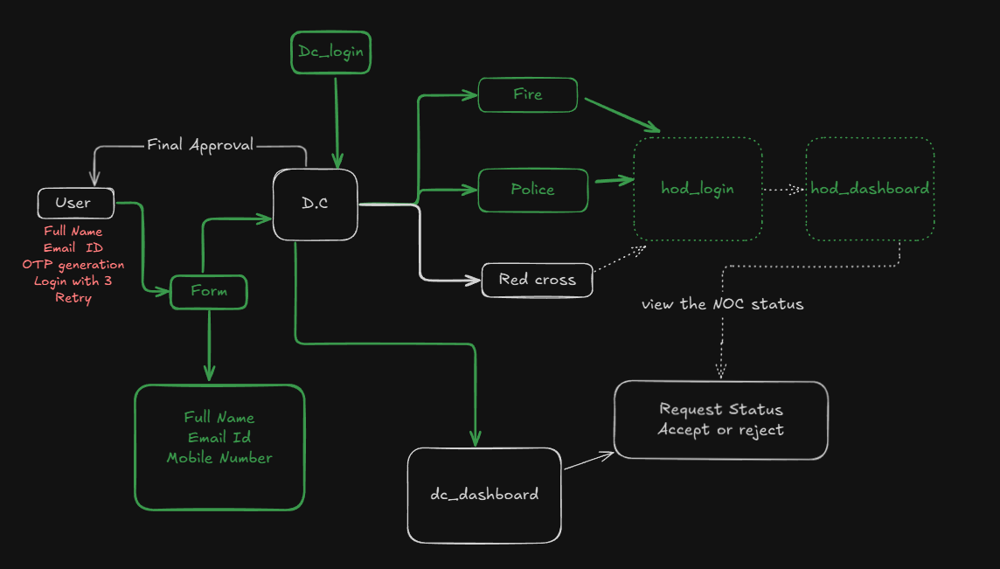

# Work flow for the firecracker stall registration system 

# N.O.C Approval Workflow

## 1. User Stage
User enters:
- **Full Name**
- **Email ID**
- **OTP Generation**
- **Login with 3 Retry attempts**

---

## 2. Form Submission
User fills out and submits:
- **Full Name**
- **Email ID**
- **Aadhar**
- **PAN**
- **Mobile Number**
- **Stall Name**

---

## 3. D.C
- Collects and verifies form details.  
- Receives **Final Approval** from the user.  
- Sends request to departments for clearance.

---

## 4. Department Approvals
-  **Fire Department** → Safety clearance  
- **Police Department** → Security clearance  
- **Red Cross** → Health or emergency compliance  

---

## 5. N.O.C (No Objection Certificate)
- Consolidates approvals from all departments.  
- Sends the final status or approval back to **D.C**.

